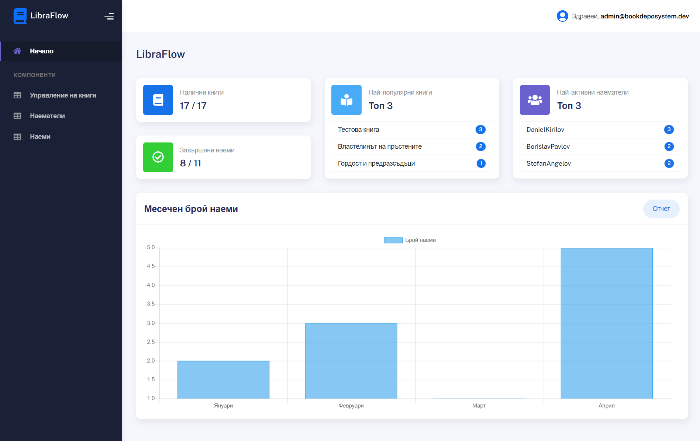

# 📚 Libraflow

Уеб приложение за управление на книгохранилище



---

## 📝 Описание

**Цел:**  
- Оптимизиране на управлението на книжните ресурси и тяхното ползване.

**Основни предимства:**
- Управление на книги и наематели
- Наем и връщане на книги
- Генериране на отчети
- Следене на наличности и история на наемите

---

## 💻 Технологии

| Категория     | Използвани технологии                     |
|---------------|-------------------------------------------|
| Език          | C#                                        |
| Технологична рамка     | .NET / ASP.NET Core              |
| ORM           | Entity Framework Core                     |
| База данни    | MS SQL Server                             |
| Фронтенд      | MVC / Razor Pages                         |
| CSS рамка     | [Bootstrap](https://getbootstrap.com/)    |
| Генериране на PDF | [QuestPDF](https://www.questpdf.com/) |
| Икони | [FontAwesome](https://fontawesome.com/icons) / [Bootstrap](https://icons.getbootstrap.com/) |
| Тестване      | xUnit                                     |

---

## 📦 Основни функционалности

- ✅ CRUD операции за книги
- ✅ Преглед и връзка с наемателите
- ✅ Наем и връщане на книги
- ✅ История на наемите
- ✅ Генериране на месечни отчети (PDF)
- ✅ Статистики
- ✅ Сортиране на книги по дата/популярност

---

## 🧪 Тестване

- 🧩 **Unit тестове** – за логика на книжен инвентар и наеми
- 🔄 **Интеграционни тестове** – за PDF генерация и реални данни
- ✅ Използване на FluentAssertions за по-ясна проверка на резултатите

---

## 🏗️ Архитектура

**Проектът следва многослойна архитектура:**
- BookDepoSystem.Common - Общи ресурси.
- BookDepoSystem.Data - Слой за достъп до данни (Entity Framework, DbContext, миграции)
- BookDepoSystem.Presentation - Презентационен слой
- BookDepoSystem.Services - Слой с бизнес логика
- BookDepoSystem.Tests - xUnit и Integration тестове


## ▶️ Стартиране на проекта

### 1. 📥 Изтегляне на проекта

```bash
git clone https://github.com/aibaev20/Libraflow.git
```

### 2. ⚙️ Настройване на базата данни

```json
// appsettings.json
"ConnectionStrings": {
  "DefaultConnection": "Server = .\\SQLEXPRESS;Database = BookDepoSystem;Trusted_Connection=true;Integrated Security=true;TrustServerCertificate=true"
}
```

### 3. 🧱 Изпълнение на миграции (с Entity Framework Core)

```bash
dotnet ef database update
```

Ако нямаш `dotnet-ef`:

```bash
dotnet tool install --global dotnet-ef
```

### 4. ▶️ Стартиране на приложението

```bash
dotnet run
```
